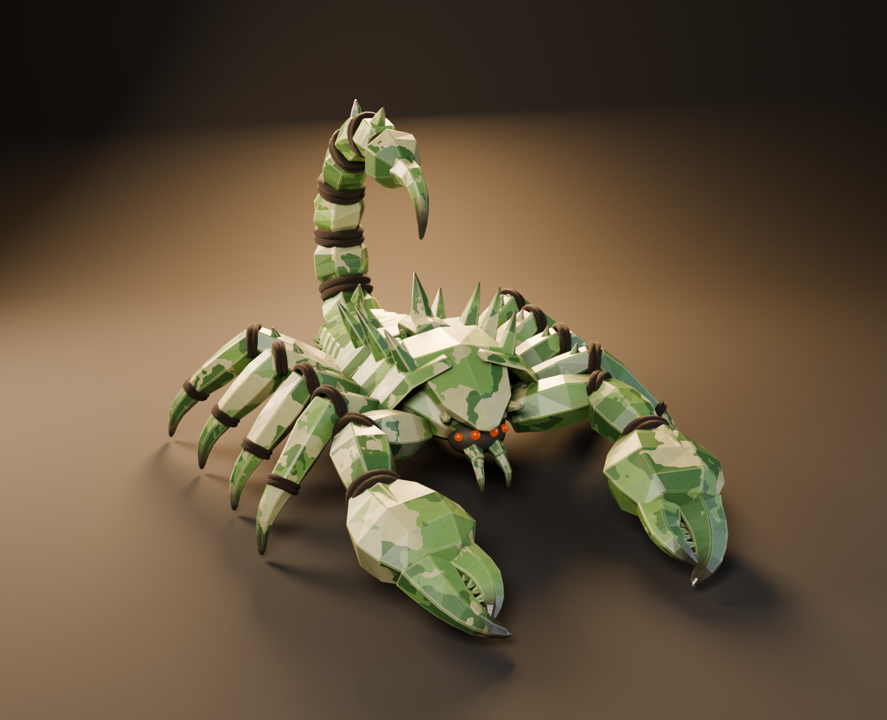

# Нефритовый скорпион (рабочее название)

Создан 5 октября 2026 года по присланному пользователем концепт-изображению: граненый каменный скорпион с нефритово-оливковым камуфляжем, темными жгутами на суставах, массивными клешнями с зубцами и оранжево-красными глазами.



## Файлы

- [jade-scorpion.blend](jade-scorpion.blend): коллекция `JADE_SCORPION` (Body, Tail, Claws, Legs, Face) и коллекция `STUDIO` с камерой, светом и циклорамой.
- Ракурсы Cycles: [beauty](previews/jade-scorpion-final-beauty.png), [спереди](previews/jade-scorpion-final-front.png), [сбоку](previews/jade-scorpion-final-side.png), [сзади](previews/jade-scorpion-final-back.png), [игровая камера](previews/jade-scorpion-final-game.png), [голова](previews/jade-scorpion-final-head.png).

## Как построено

Вся геометрия создана скриптом [scorpion_build.py](../../../tools/scorpion_build.py) в Blender 5.2.2 LTS, без внешних генераторов и скачанных ассетов:

- сегменты панциря, ног, хвоста и клешней: граненые кольца вдоль ломаной с шумом вершин, плоское затенение и фаска в 1 сегмент;
- материал `JS Jade camo`: пятна Voronoi с искажением, светлые сколы по ребрам (Bevel node, только Cycles), темные кончики по атрибуту вершин `tip`;
- суставы: несколько колец-жгутов вокруг стыка.

Около 35.5 тысяч треугольников после модификаторов, 156 мешей.

## Ограничения

Презентационная модель: нет UV, текстур (материал процедурный), рига, анимаций, LOD и экспорта в Unity. Подсветка ребер работает только в Cycles; в EEVEE и Material Preview ее нет. Самопересечения деталей не проверялись. Художественная приемка пользователем не получена.

## Воспроизведение

Из корня `game`:

```powershell
$bl = 'C:\Program Files\Blender Foundation\Blender 5.2\blender.exe'
& $bl --background --factory-startup --disable-autoexec --offline-mode --python-exit-code 1 --python tools/scorpion_build.py
& $bl --background --factory-startup --disable-autoexec --offline-mode art/creatures/jade-scorpion/jade-scorpion.blend --python-exit-code 1 --python tools/scorpion_render.py -- final
```

Сборщик перезаписывает `jade-scorpion.blend`.

## Unity

Игровая версия собрана скриптом [scorpion_export.py](../../../tools/scorpion_export.py) и лежит в [game/](game/): 13686 треугольников вместо 35.5 тысяч (без модификатора Bevel, светлые сколы ребер запечены в текстуру; жгуты децимированы до 35%), один материал, UV, запеченные текстуры 2048 (альбедо с AO, сколами и темными кончиками, эмиссия глаз), FBX с пивотом на земле под центром тела.

В проекте Unity: `Assets/Creatures/JadeScorpion/JadeScorpion.prefab`, материал URP Lit `JadeScorpion.mat` с картами альбедо и эмиссии. Настройку выполняет [scorpion_setup.cs](../../../tools/unity/scorpion_setup.cs) в открытом редакторе через `unity command eval_file`, без изменения открытой сцены. Проверено: скорпион смотрит в +Z, габариты 2.83 x 2.05 x 3.81 м, один сабмеш, ошибок консоли нет, [кадр из Unity](../../../verification/jade-scorpion-unity.png), [отчет](../../../verification/jade-scorpion-unity.json).

Не сделано: риг, анимации, коллайдер, LOD, размещение в сцене арены. Модель статична.

```powershell
& $bl --background --factory-startup --disable-autoexec --offline-mode art/creatures/jade-scorpion/jade-scorpion.blend --python-exit-code 1 --python tools/scorpion_export.py
New-Item -ItemType Directory -Force unity/Assets/Creatures/JadeScorpion
Copy-Item art/creatures/jade-scorpion/game/JadeScorpion.fbx, art/creatures/jade-scorpion/game/JadeScorpion_*.png unity/Assets/Creatures/JadeScorpion
cd unity; & 'C:\Program Files\Unity Hub\resources\unity.exe' command eval_file --file ..\tools\unity\scorpion_setup.cs --timeout 300
```
