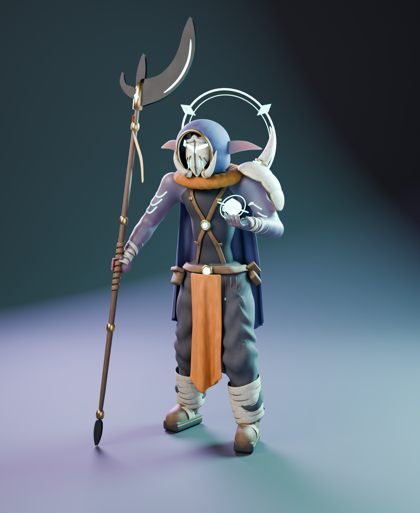

# Hexblade (рабочее название)

Создан 5 октября 2026 года по поручению: переосмыслить героя в духе Warcraft на современный лад, не копируя оригинал. Отправная точка - архетип лесного охотника-мистика в маске (в Warcraft III это ниша Shadow Hunter). Силуэт, маска, костюм, оружие и эффекты собственные; модели, текстуры, эмблемы и названия Warcraft не использовались.



## Дизайн

- Долговязый сутулый гуманоид (ноги удлинены, верх корпуса и голова вынесены вперед) с длинными ушами и клыками: преувеличенные пропорции и читаемый силуэт сверху.
- Резная костяная маска-тотем: гребенчатая дуга над сплошь горящими прорезями, черные резные бороздки, бирюзовые насечки; клыки обрамляют маску по бокам.
- Современный слой: оверсайз-капюшон с латунным кантом, вязаный снуд, облегающий топ без рукавов, X-портупея с пряжками, джоггеры с поперечными складками, заправленные в обмотки, массивная подошва с оранжевой полосой.
- Асимметрия: костяной наплечник из трех пластин с одним мощным рогом только слева.
- Магия: светящийся нимб с тремя кристаллами за спиной, сфера с орбитами в открытой ладони, татуировки-шевроны.
- Оружие: глефа с широким заточенным полумесяцем, шипом, крюком, светящейся кромкой и лентой.
- Палитра: индиго, графит, кость, латунь, жженый оранжевый, бирюзовое свечение.

Имя, лор и фракция не назначались; это не канон игры.

## Файлы

- [hexblade.blend](hexblade.blend) - модель (коллекция `HEXBLADE`: Body, Cloth, Gear, Weapon, Magic) и коллекция `STUDIO` с камерой, светом и циклорамой. Открывается сразу в виде из камеры с материалами.
- Ракурсы Cycles: [beauty](previews/hexblade-final-beauty.png), [спереди](previews/hexblade-final-front.png), [сбоку](previews/hexblade-final-side.png), [сзади](previews/hexblade-final-back.png), [игровая камера](previews/hexblade-final-game.png), [крупно](previews/hexblade-final-head.png).
- [Отчет проверки](../../../verification/hexblade-validate.json).

## Как построено

Вся геометрия создана собственным Python-скриптом в Blender 5.2.2 LTS, без внешних генераторов и скачанных ассетов:

- тело, кисти, ботинки и штаны: metaball-анатомия с плавным слиянием, затем сглаживание; складки штанов процедурные;
- граница кожи и топа: атрибут-поле на вершинах и изолиния в шейдере, поэтому край ровный, а не по полигонам;
- маска: контур с прорезями глаз, заполненный и изогнутый по лицу, плюс рельеф;
- ремни и татуировки: ленты, спроецированные на тело через BVH;
- плащ и набедренники: cloth-симуляция с коллизией о тело, затем запечка и вертикальные складки;
- клинки: контур с двусторонней заточкой.

## Проверено

- `tools/hexblade_validate.py`: 110 мешей, 513062 evaluated triangles, нет неконечных координат, пустых мешей, мешей без материала и висячих вершин; нижняя точка Z = 0.0003 м.
- SHA256 финального `hexblade.blend`: `2004787BC130E3772DEE92C111FE35A863AFD63F05DB6D100F9CE3BCD117D0E6`.
- Рендеры получены из сохраненного `.blend` (Cycles, OptiX, RTX 2080 Ti), исходник при рендере не меняется (проверка SHA256 в скрипте).

## Ограничения

Это презентационная модель, не игровой ассет: нет UV-развертки и текстур (материалы процедурные), нет ретопологии под бюджет (около 513 тысяч треугольников), рига, анимаций, LOD и экспорта в Unity. Самопересечения между объектами валидатор не проверяет. Художественная приемка пользователем не получена.

## Воспроизведение

Из корня `game`:

```powershell
$bl = 'C:\Program Files\Blender Foundation\Blender 5.2\blender.exe'
& $bl --background --factory-startup --disable-autoexec --offline-mode --python-exit-code 1 --python tools/hexblade_build.py
& $bl --background --factory-startup --disable-autoexec --offline-mode art/heroes/hexblade/hexblade.blend --python-exit-code 1 --python tools/hexblade_validate.py
& $bl --background --factory-startup --disable-autoexec --offline-mode art/heroes/hexblade/hexblade.blend --python-exit-code 1 --python tools/hexblade_render.py -- final beauty front side back game head
powershell -File tools/blender-gui.ps1 -File art/heroes/hexblade/hexblade.blend
```

Сборщик перезаписывает `hexblade.blend`. Последняя команда открывает GUI с мостом Claude Code (см. [blender-claude-code.md](../../../docs/blender-claude-code.md)).

## Unity

Игровая версия собрана скриптом [hexblade_export.py](../../../tools/hexblade_export.py) и лежит в [game/](game/): 52890 треугольников вместо 513 тысяч, один материал, UV, запеченные текстуры 2048 (альбедо с AO и градиентом, эмиссия свечения), FBX с пивотом у ног. Каждая деталь децимирована отдельно, мелкие кольца и руны сохраняют минимум 400 треугольников.

В проекте Unity: `Assets/Heroes/Hexblade/Hexblade.prefab` (prefab-вариант FBX), материал URP Lit `Hexblade.mat` с картами альбедо и эмиссии. Настройку выполняет [hexblade_setup.cs](../../../tools/unity/hexblade_setup.cs) в открытом редакторе через `unity command eval_file`, без domain reload и без изменения открытой сцены. Проверено: герой смотрит в +Z, высота 2.82 м, один сабмеш, консоль без ошибок, [кадр из Unity](../../../verification/hexblade-unity.png), [отчет](../../../verification/hexblade-unity.json).

Не сделано: риг, анимации, коллайдер, LOD, размещение в сцене арены. Модель статична.

```powershell
& $bl --background --factory-startup --disable-autoexec --offline-mode art/heroes/hexblade/hexblade.blend --python-exit-code 1 --python tools/hexblade_export.py
Copy-Item art/heroes/hexblade/game/Hexblade.fbx, art/heroes/hexblade/game/Hexblade_*.png unity/Assets/Heroes/Hexblade
cd unity; & 'C:\Program Files\Unity Hub\resources\unity.exe' command eval_file --file ..\tools\unity\hexblade_setup.cs --timeout 300
```
