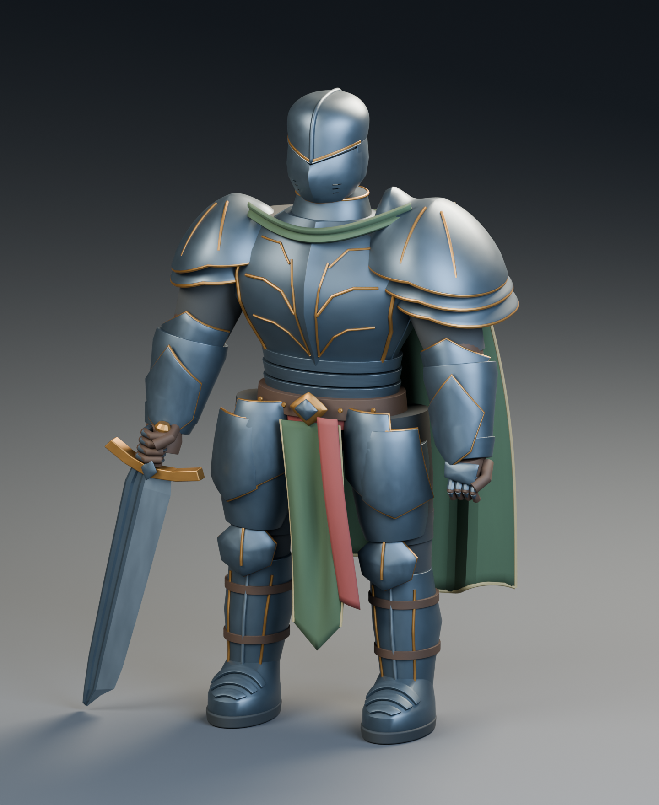

# Новый рыцарь: версия для визуального просмотра

Создан локально 5 октября 2026 года после поручения переработать рыцаря с учетом проверки метода на наковальне. Выбрана новая геометрия; прежние `veteran` и `astra-bust-trial` сохранены. Это один персонаж, без реализации игровых механик.



## Файлы

- [knight.blend](knight.blend) - редактируемая модель, коллекция KNIGHT с группами тела, брони, ткани, оружия и шлема.
- [knight-presentation.blend](knight-presentation.blend) - та же модель с камерой и студийным светом для просмотра.
- Ракурсы: [спереди](previews/knight-front.png), [сбоку](previews/knight-side.png), [сзади](previews/knight-back.png), [сверху под углом](previews/knight-game.png), [шлем крупно](previews/knight-head.png).
- [Исходная постановка](brief.md), [компонент шлема](helmet-study/README.md), [геометрический отчет](../../../verification/knight-v3-knight.json).

Рендеры выше получены из реального `.blend` в Cycles, без дорисовки изображения. Актуальная сборка обозначена r8 в локальных логах. `knight-blockout.blend`, `previews/blockout-v1`, `previews/final-r1` и `helmet-study/v1` сохраняют промежуточные состояния, не являются итоговым ассетом.

Промежуточные состояния и журналы сохранены только локально и не включены в Git. В репозитории находятся итоговая модель, сцена просмотра, шесть финальных ракурсов, актуальные отчеты и детализированный компонент шлема.

## Дизайн и результат

Сохранены общие признаки [концепта](../../concepts/2026-10-05-heavy-warrior-v2.png): тяжелая сталь, бронзовые края, зеленая ткань, бордовый пояс, широкая грудь, разные по массе наплечники и крупный меч. Авторское решение этой версии - закрытый шлем с V-образной бровью вместо открытого лица. Биография, имя и фракция не назначались; эта модель не утверждает канон игры.

Работа проходила через серую сборку и проверку нескольких ракурсов. Исправлены разрывы суставов, однотипные наплечники, форма груди, зависший орнамент, сквозные пересечения плаща, неправильный хват меча, проекция накладных пластин и выступающие детали ботинок. Шлем содержит настоящие прорези, меч - объемный спуск и углубленный дол. Все формы созданы собственными Blender Python-скриптами, без внешних генераторов и скачанных ассетов.

Это более связная визуальная модель, но уровень проработки исходного концепта не достигнут. Формы и ткань остаются упрощенными. Процедурные материалы и статичная поза предназначены для оценки дизайна. Художественная приемка пользователем не подтверждена; не называть результат готовым игровым героем.

## Проверено

Blender 5.2.2 LTS; Cycles / OptiX / NVIDIA GeForce RTX 2080 Ti. Финальный файл повторно открыт в отдельном background-процессе. Проверены 160 объектов и 105806 evaluated triangles, единицы в метрах, опора двух подошв на Z=.025. Валидатор не нашел nonfinite-координат, треугольников площадью не более 1e-12 м², открытых или неманифолдных ребер, нарушений winding, отрицательных замкнутых компонентов и отсутствующих материалов. Внешних зависимостей нет. SHA256 исходника не изменился при рендере и проверке.

Исходник r8: `82b857cc787277a630bece2f2eb90d86d79c1b440dcf008622ddb94d0c2a4474`.

Валидатор не проверяет все пересечения между объектами и не оценивает художественное качество. Полная UV-развертка, ретопология под игровой бюджет, риг, анимации, collision mesh, экспорт и импорт в Unity не выполнены. Отсутствие UV явно отмечено в отчете; процедурный материал не является готовым набором игровых текстур.

## Воспроизведение

Запускать из корня `game`, только отдельным background-процессом. Скрипты не сохраняют preferences и не управляют уже открытыми окнами Blender.

```powershell
& 'C:/Program Files/Blender Foundation/Blender 5.2/blender.exe' --background --factory-startup --disable-autoexec --offline-mode --python-exit-code 1 --python tools/knight_build.py -- --stage final
& 'C:/Program Files/Blender Foundation/Blender 5.2/blender.exe' --background --factory-startup --disable-autoexec --offline-mode art/heroes/knight-v3/knight.blend --python-exit-code 1 --python tools/knight_render.py -- final beauty back side head front game
& 'C:/Program Files/Blender Foundation/Blender 5.2/blender.exe' --background --factory-startup --disable-autoexec --offline-mode art/heroes/knight-v3/knight.blend --python-exit-code 1 --python tools/knight_validate.py
& 'C:/Program Files/Blender Foundation/Blender 5.2/blender.exe' --background --factory-startup --disable-autoexec --offline-mode art/heroes/knight-v3/knight.blend --python-exit-code 1 --python tools/knight_render.py -- prepare
```

Сборщик перезаписывает только собственный `knight.blend`. Перед повторной генерацией сохраните ручные изменения в отдельную копию. Исходники: [сборка](../../../tools/knight_build.py), [формы](../../../tools/knight_shapes.py), [шлем](../../../tools/knight_helmet.py), [рендер](../../../tools/knight_render.py), [проверка](../../../tools/knight_validate.py). Финальные логи: `.local/knight-v3/final-build-r8.log`, `final-render-r8.log`, `qa-final-r8.log`, `prepare-final.log`.

`prepare` принимает исходную модель и создает отдельную сцену просмотра. Передача самого `knight-presentation.blend` в этот режим отклоняется до изменения сцены, чтобы не перезаписать входной файл. Отрицательная проверка перед коммитом подтвердила ожидаемый отказ и неизменный SHA256 презентации.
